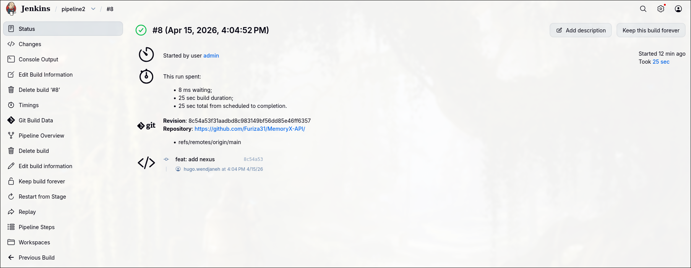
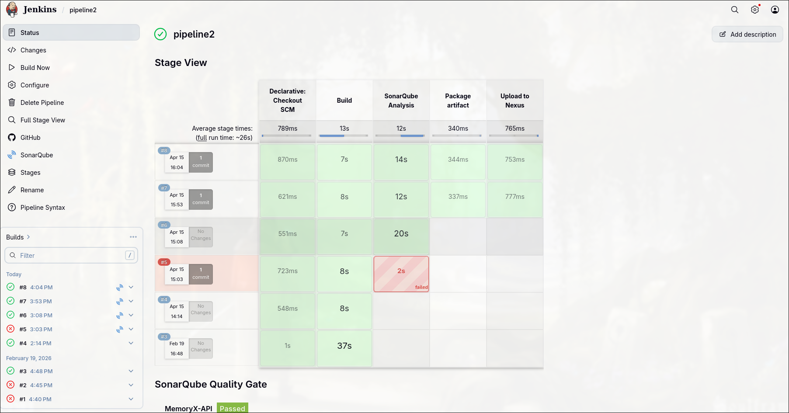
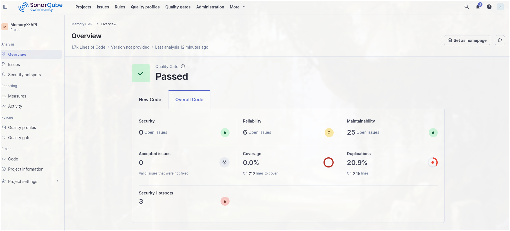
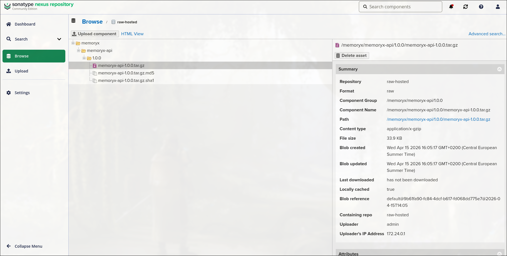

= MemoryX-API
:toc:
:toclevels: 5
v1
The MemoryX REST API

Hugo Wendjaneh - Fouad ID GOUAHMANE

== TP 1









=== Jetkins file

```yaml
pipeline {
    agent any

    stages {
        stage('Build') {
            steps {
                sh 'chmod +x ./run-dev-tests-build.sh'
                sh './run-dev-tests-build.sh'
            }
        }

        stage('SonarQube Analysis') {
            when {
                anyOf {
                    branch 'main'
                    branch 'dev'
                }
            }
            steps {
                script {
                    def scannerHome = tool 'SonarScanner'
                    withSonarQubeEnv('SonarQube') {
                        sh """
                            ${scannerHome}/bin/sonar-scanner \
                              -Dsonar.projectKey=MemoryX-API \
                              -Dsonar.projectName=MemoryX-API \
                              -Dsonar.sources=. \
                              -Dsonar.token=$SONAR_AUTH_TOKEN
                        """
                    }
                }
            }
        }

        stage('Package artifact') {
            when {
                branch 'main'
            }
            steps {
                sh '''
                    rm -f memoryx-api.tar.gz
                    tar -czf memoryx-api.tar.gz dist package.json package-lock.json README.adoc
                '''
            }
        }

        stage('Upload to Nexus') {
            when {
                branch 'main'
            }
            steps {
                nexusArtifactUploader(
                    nexusVersion: 'nexus3',
                    protocol: 'http',
                    nexusUrl: 'localhost:8081',
                    groupId: 'memoryx',
                    version: '1.0.0',
                    repository: 'raw-hosted',
                    credentialsId: 'nexus-creds',
                    artifacts: [
                        [
                            artifactId: 'memoryx-api',
                            classifier: '',
                            file: 'memoryx-api.tar.gz',
                            type: 'tar.gz'
                        ]
                    ]
                )
            }
        }

        stage('Feature branch info') {
            when {
                expression {
                    env.BRANCH_NAME.startsWith('feature/')
                }
            }
            steps {
                echo "Pipeline léger exécuté pour ${env.BRANCH_NAME}"
            }
        }
    }
}
```

==== Explanation
- The pipeline has four stages: Build, SonarQube Analysis, Package artifact, and Upload to Nexus.
- The Build stage runs the `run-dev-tests-build.sh` script, which installs dependencies, runs tests, and builds the project.
- The SonarQube Analysis stage runs only on the `main` and `dev` branches and performs code analysis using SonarQube.
- The Package artifact stage runs only on the `main` branch and packages the built application into a tar.gz file.
- The Upload to Nexus stage runs only on the `main` branch and uploads the packaged artifact to a Nexus repository.
- The Feature branch info stage runs only for branches that start with `feature/` and prints a message indicating that a lightweight pipeline was executed for the feature branch.


== Getting started
=== Prerequisites
- https://nodejs.org/en/[Node.js] (v10.15.3)
- https://www.npmjs.com/[npm] (v6.4.1)

=== Installation
1. Clone the repository
2. Install dependencies
```bash
npm install
```

=== Initialize the database
```bash
npm run migrate
npm run generate
```

=== Set up environment variables
Create a `config.json` file in the root directory of the project and add the following variables:
```json
{
  "JWT_SECRET": "secretkey",
  "JWT_EXPIRES_IN": "1h",
  "PORT": 3000,
  "SALT_ROUNDS": 10
}
```

Create a `.env` file in the root directory of the project and add the following variables:
```json
DATABASE_URL="file:./dev.db"
```

=== Run the server
```bash
npm run dev
```

== Run tests
```bash
npm run test
```

== Run build
```bash
npm run build
```

== Start, after build
```bash
npm run start
```

== API Documentation
See <<run-the-server, Run the server>> and navigate to http://localhost:3000/


== Modify the database
See https://www.prisma.io/docs/concepts/database-connectors/sqlite[Prisma SQLite documentation] before modifying the database.

=== Make a change to the database schema
==== Modify the schema
Edit `prisma/schema.prisma` to whatever you want the new schema to be.

==== Make a migration
After modifying the schema, run the following command to generate a migration:
```bash
npm run migrate
```
Then name your migration and press enter.

==== Generate the Prisma client
```bash
npm run generate
```